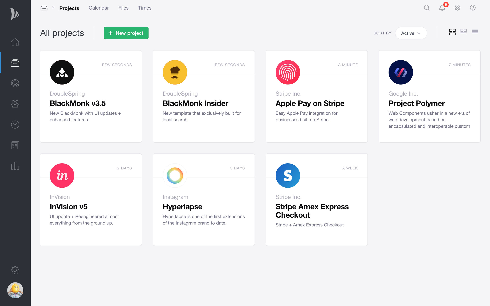
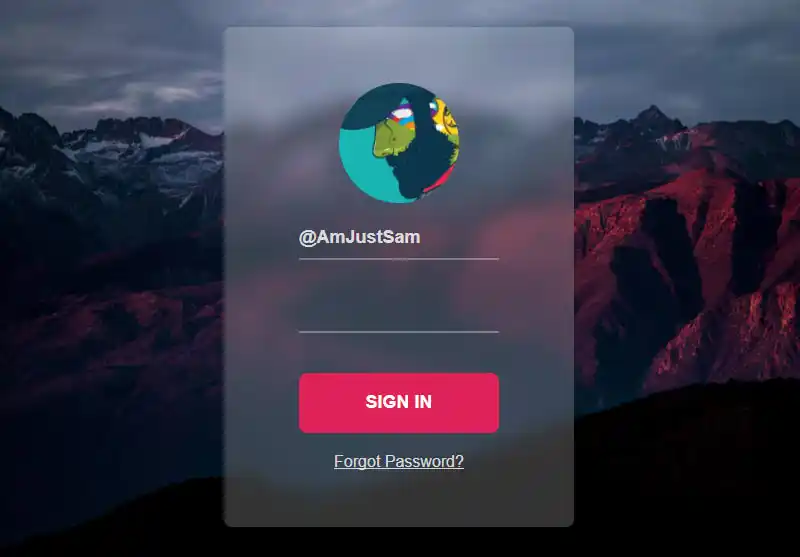
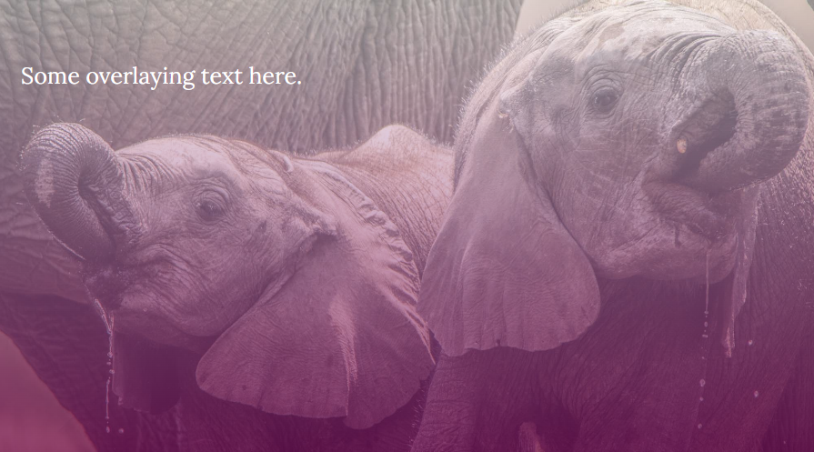
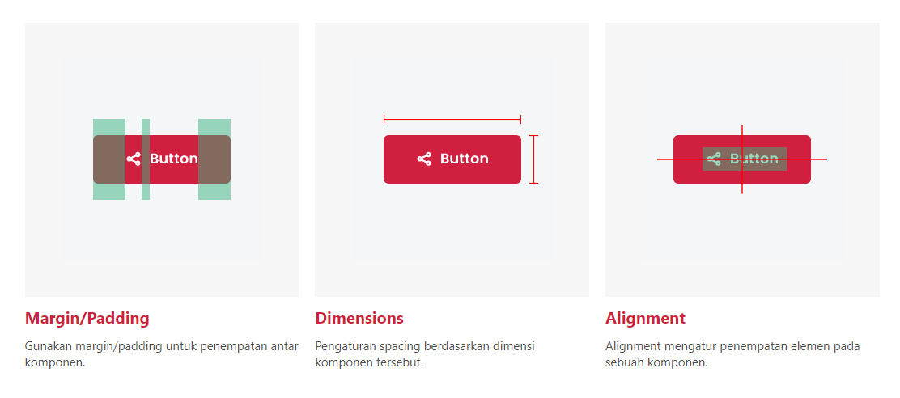
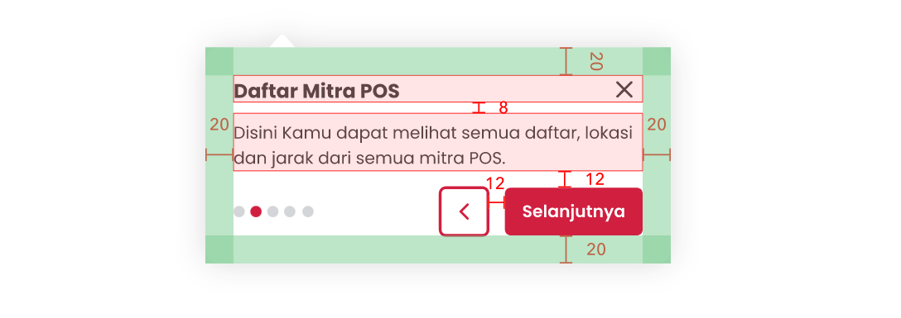

# Web Design

Web design adalah orang yang memiliki keahlian untuk membuat tampilan website menjadi menarik. Misalnya efek ilustrasi pada website, tipografi, keseimbangan kontras, layout, dll. Web design juga fokus membuat desain dengan pendekatan user experience agar mudah untuk digunakan.

### Mengenal Typography

Typography adalah seni untuk mengatur tulisan-tulisan agar tulisan yang dibaca lebih enak untuk dibaca dan lebih cantik.

Style Guide Typography :
- Ukuran Font. Ukuran font rata-rata yang digunakan diantara 15px sampai 25px. Dengan menggunakan ukuran font rata-rata tersebut, user dapat melihat font secara ideal seperti tidak kebesaran dan tidak terlalu kecil.
- Headline. Headline harus mempunyai ukuran font lebih besar dibanding dengan tulisan-tulisan yang lain.
- Line Spacing. Line spacing standar memiliki ukuran 120% sampai 150%. Dengan ukuran tersebut line spacing tidak terlalu panjang dan tidak terlalu pendek.
- Typography. Typography yaitu cara memilih font yang bagus untuk tulisan website. Dalam pemilihan font gunakan jenis font yang sesuai dengan tema pada website, misalnya untuk webiste yang simple, clean, maka gunakan font yang clean dan simpe juga seperti sans serif atau yang lainnya.

Jika pemilihan font sudah ditentukan, maka gunakan font tersebut secara konsisten dan tidak campur dengan jenis font lainnya.

### Bekerja Dengan Gambar

Beberapa cara memngombinasikan layout antara text dengan gambar: 

###### Text Over Image
Text diposisikan langsung diatas gambar, fungsinya untuk mempertegas pendefinisian gambar. kemudian gambar di overlay dengan warna gelap agar memiliki kontras yang pas sehingga text dapat dengan mudah dibaca.

###### Text In Box
Text dapat ditempatkan di dalam box, sehingga text dapat dibaca dengan mudah. Biasanya teknik ini digunakan pada komponen card pada website.

###### Blur Image
background image dapat di blur agar text dapat terlihat dengan jelas.

###### Gradient image
Gradient image adalah cara untuk membuat background image menjadi gradient.

### Spacing & Layout

Layout & Spacing yang konsisten menciptakan keseimbangan visual yang membuat antarmuka aplikasi atau website lebih seamless, scanable, easy to follow experience. Tentunya dengan Layout & Spacing yang konsisten akan meningkatkan kualitas antarmuka.

### Pengenalan UX (User Experience)

User Experience adalah adalah bagaimana seorang pengguna internet mengakses website, suatu pengalaman yang mereka dapatkan dari website tersebut. Contoh User Experience adalah mengeksplorasi semua fitur website yang ada, melihat tampilan website-nya, dan melakukan prosedur hingga berhasil transaksi produk/jasa.