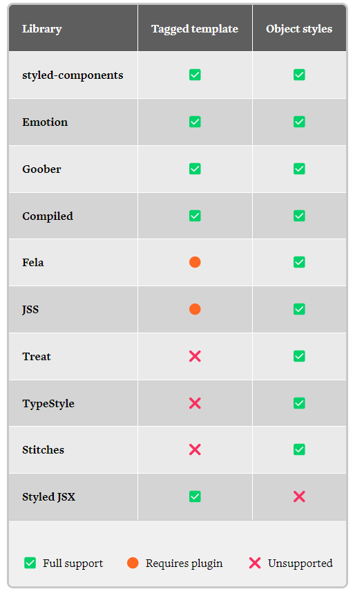

# Styling Component

Ada banyak cara membuat aplikasi React kita menjadi lebih 'cantik'. Kita akan membahas beberapa opsi. Mulai dari CSS yang umum digunakan hingga solusi css in js yang sedang dalam trend.

## 1. Inline CSS

Inline CSS adalah cara yang paling sederhana untuk membuat aplikasi React kita menjadi lebih 'cantik'. Kita bisa menambahkan properti `style` pada elemen HTML yang kita inginkan. Contoh:

```jsx
const App = () => {
  return (
    <div style={{ color: 'red' }}>
      <h1>Ini adalah contoh inline CSS</h1>
    </div>
  )
}
```

## 2. Object Variable CSS

Kita bisa membuat object variable CSS yang nantinya akan kita gunakan pada properti `style` pada elemen HTML yang kita inginkan. Contoh:

```jsx
const App = () => {
  const style = {
    color: 'red',
    backgroundColor: 'yellow',
    padding: '10px',
    margin: '10px'
  }

  return (
    <div style={style}>
      <h1>Ini adalah contoh object variable CSS</h1>
    </div>
  )
}
```

## 3. External CSS

Sama seperti HTML, kita bisa membuat file CSS yang nantinya akan kita import ke dalam file JavaScript. Contoh:

```jsx
// App.js
import './App.css'

const App = () => {
  return (
    <div className="container">
      <h1>Ini adalah contoh external CSS</h1>
    </div>
  )
}
```

```css
/* App.css */
.container {
  color: red;
  background-color: yellow;
  padding: 10px;
  margin: 10px;
}
```

## 4. External CSS Modules

Kita bisa membuat file CSS yang nantinya akan kita import ke dalam file JavaScript. Namun, kita bisa membuat file CSS kita menjadi lebih modular. Contoh:

```jsx
// App.js
import styles from './App.module.css'

const App = () => {
  return (
    <div className={styles.container}>
      <h1>Ini adalah contoh external CSS modules</h1>
    </div>
  )
}
```

```css
/* App.module.css */
.container {
  color: red;
  background-color: yellow;
  padding: 10px;
  margin: 10px;
}
```

## 5. External Object Variable CSS

Sama seperti External CSS, hanya saja kali ini bentuk nya adalah Object Variable CSS

```jsx
// App.js
import divStyle from '/AppStyle.js';

const App = () => {
  return (
    <div style={divStyle}>
      <h1>Ini adalah contoh external object variable CSS</h1>
    </div>
  )
}
```

```js
// AppStyle.js
const divStyle = {
  color: 'red',
  backgroundColor: 'yellow',
  padding: '10px',
  margin: '10px'
}

export default divStyle
```

## 6. Styled Components

Styled Components adalah salah satu solusi css in js yang sedang hot. Kita bisa membuat komponen React yang memiliki style CSS nya sendiri. Contoh:

pertama kita install styled components

```bash
npm install styled-components
```

selanjutnya kita impelementasikan styled components


```jsx
import styled from 'styled-components'

const Container = styled.div`
  color: red;
  background-color: yellow;
  padding: 10px;
  margin: 10px;
`;

export default function App() {
  return (
    <Container>
      <h1>Ini adalah contoh styled components</h1>
    </Container>
  )
}
```

## 7. CSS in JS Libraries

CSS in JS menjadi semakin populer akhir-akhir ini sebagai library yang menyediakan fungsionalitas untuk bisa memberikan styling pada React component kita. 

Beberapa library yang bisa kita gunakan antara lain:

<div align="center">



</div>

