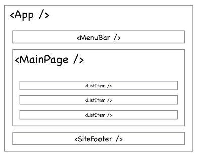
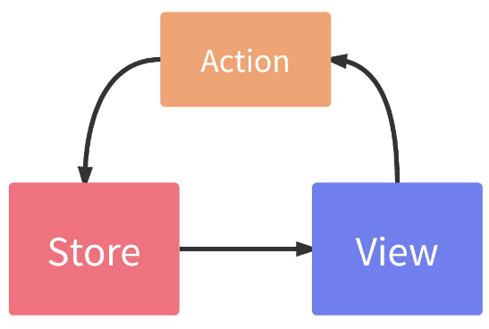
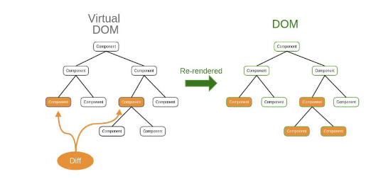
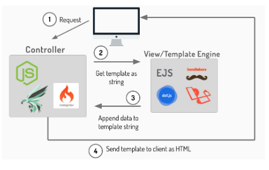
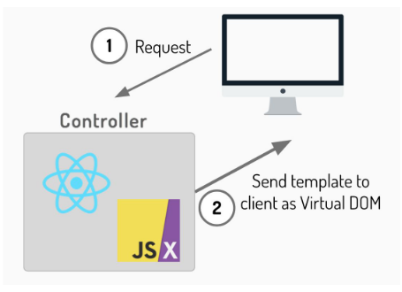

# Pengenalan React

 

## Apa itu React?

React adalah sebuah library JavaScript yang digunakan untuk membangun user interface (UI) yang interaktif. React dibuat oleh Facebook dan sekarang menjadi salah satu library JavaScript yang paling populer. React dapat digunakan untuk membangun aplikasi web, mobile, dan desktop.

React dibuat oleh Jordan Walke, seorang programmer di Facebook. React pertama kali diumumkan pada 5 Mei 2013. React pertama kali diimplementasikan pada Facebook pada 2011. React pertama kali diumumkan pada 5 Mei 2013. React pertama kali diimplementasikan pada Facebook pada 2011.

 

## Konsep utama React

React memiliki beberapa konsep utama yang harus dipahami. Konsep-konsep tersebut adalah:

  * Component
  * Virtual DOM
  * JSX
  * Props
  * State
  * Lifecycle
  * Hooks

Namun dari beberapa konsep diatas konsep Component dan Virtual DOM adalah konsep yang paling penting.

 

## Component

Mindset utama dari React adalah Component. Sehingga, sebuah website yang menggunakan React adalah kumpulankomponen yang kita definisikan, lengkap dengan karakter, style, dan fitur-fitur masing-masing

Komponen utama dalam React biasanya adalah App.js. Dan dari contoh pada gambar di atas, halaman web ini memiliki komponen :
- MenuBar
- MainPage
- SiteFooter

Komponen ListItem adalah bagian dari komponen MainPage

 

## Aliran data Satu Arah

Sedikit berbeda dengan beberapa framework sepertiAngular yang menerapkan aliran data dua arah, di Reactdata hanya mengalir satu arah. Hal ini menjadi signifikankarena dengan menerapkan hal ini, perubahan datamenjadi lebih mudah dimengerti dan lebih mudahdiprediksi.Aliran data di React dapat diilustrasikan seperti berikut.

View adalah kumpulan komponen yang sudah kita bahas di bagian sebelumnya. Di viewjuga ada berbagai action seperti onClick ketika button di klik, onChange ketika pengguna memasukkan data di form dan banyak lagi. Dan di React, semua data disimpan ke dalam sebuah wadah yang disebut dengan store atau state.

Uniknya, ketika terjadi perubahan data, katakanlah seorang pengguna meng-klik button atau action yang lainnya, view tidak bisa mengubah data atau apapun juga. View harus menghubungi action dan memberitahu bahwa ada sebuah action yang di trigger oleh pengguna. Dan tugas action-lah yang kemudian menghubungi store untuk kemudian mengubah data sesuai actionnya. 

Setelah itu baru kemudian store mengubah view hingga sesuai dengan data yang baru saja berubah. Jadi satu jalur, dari view ke action ke store dan kembali ke view. Dan tidak bisa sebaliknya. Untuk mengubah data, view harus selalu melalui actiondan seterusnya.

 

## Virtual DOM

Virtual DOM adalah sebuah konsep yang digunakan untuk mempercepat proses rendering. Virtual DOM adalah sebuah representasi dari DOM yang ada di browser. Virtual DOM ini akan selalu sinkron dengan DOM yang ada di browser. Jadi ketika terjadi perubahan data, maka Virtual DOM akan melakukan perubahan data sesuai dengan data yang baru. Dan kemudian Virtual DOM akan melakukan perbandingan dengan DOM yang ada di browser. Jika terdapat perbedaan, maka Virtual DOM akan melakukan perubahan DOM yang ada di browser.

DOM ini strukturnya berbentuk tree atau pohon. Dan ketika sebuah elemen diakses, dimodifikasi ataupun membuat elemen baru, browser harus mencari ke seluruh cabang-cabang dari pohon DOM tersebut. Dan hal itu membutuhkan waktu yang lama dan komputasi yang cukup berat.

Virtual DOM ini sebenarnya hanyalah struktur data yang menyimpan informasi lengkap tentang DOM. Seperti blue print kalau kita mau membangun rumah atau ruangan. Jadi setiap kali terjadi perubahan data dan harus mengubah DOM, React melakukan perubahan tersebut di Virtual DOM terlebih dahulu. Baru kemudian React membandingkan Virtual DOM yang sudah berubah dengan DOM yang sebenarnya. Jika ada yang berbeda, VirtualDOM akan mengubah DOM yang berubah saja, jadi tidak semuanya diganti sehingga tidak seberat jika harus mengubah seluruh pohon DOM.

 

## JSX

JSX adalah sebuah sintaks yang digunakan untuk mendefinisikan elemen HTML di dalam JavaScript. JSX ini memungkinkan kita untuk menulis kode HTML di dalam JavaScript. Dan JSX ini akan diubah menjadi kode JavaScript yang dapat dijalankan di browser.

### Template Engine vs JSX

Template engine adalah sebuah library yang digunakan untuk mengubah template HTML menjadi kode HTML yang dapat dijalankan di browser. Template engine ini biasanya digunakan untuk membuat halaman web dinamis. Contoh template engine yang sering digunakan adalah EJS, Pug, Handlebars, dll.

Ketika ada permintaan untuk memunculkan sebuah halaman melalui browser dan pengguna mengunjungi halaman tertentu atau dengan istilah yang lebih teknis, pengguna mengakses route tertentu dan route tersebut memanggil controller, yang kemudian akan merender halaman berdasarkan template yang berkaitan dengan controller dan route tersebut. Proses render tersebut sederhananya adalah melakukan concat terhadap string dengan menambahkan data-data yang disertakan di route atau controller tersebut. Proses append string template dengan data tersebut bukanlah operasi yang ringan apalagi ketika template sudah cukup kompleks dan besar ukurannya. Setelah proses append string dan rendering selesai baru kemudian string yang sudah ditambahkan data tersebut dikirimkan kembali ke pengguna.

Ilustrasi di bawah menggambarkan bagaimana framework yang memanfaatkan templating language bekerja.

Sementara, ketika kita menggunakan JSX, proses menjadi lebih simpel. Framework tidak lagi perlu melakukan proses rendering dalam bentuk append string yang butuh tenaga komputasi cukup besar. Framework tinggal menterjemahkan hasil dari JSX yang ditranspilasi menjadi fungsi-fungsi (bukan string) menjadi tag-tag html dan langsung mengirimkan hasilnya kembali ke pengguna.

Ilustrasi di bawah menggambarkan bagaimana framework yang memanfaatkan JSX bekerja.

