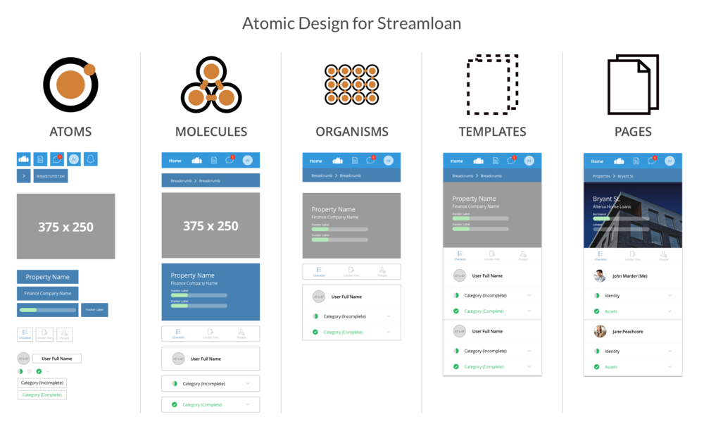

# Data Flow, Proptypes, dan Atomic Design

<br/>

## Data Flow

Seperti yang sudah kita bahas di bagian sebelumnya, aliran data React ini bersifat satu arah. Dari view ke action ke store dan dari store balik lagi ke view.Untuk saling berinteraksi antar komponen.

**React mempunyai dua cara: state dan props.**
 
 Masing-masing punya tugas dan tujuan yang berbeda. State digunakan untuk menyimpan kondisi saat ini untuk komponen, sementara props digunakan untuk mengirimkan informasi ke komponen lain.

 <div align="center">


 </div>

### State

State adalah data yang bisa berubah-ubah. State ini bisa berubah karena ada interaksi dari user atau karena ada perubahan dari data yang ada di dalam state itu sendiri.

```javascript
import React from 'react';

export default class Counter extends React.Component {
    // Mendefinisikan state
    constructor(props) {
        super(props);
        this.state = {
            count: 0
        };

        // Binding method - ini dilakukan jika kita membuat method dengan 
        // menggunakan function declaration
        // karena this pada function declaration tidak mengacu ke class Counter
        this.increment = this.increment.bind(this);
        this.decrement = this.decrement.bind(this);
    }

    // Membuat method dengan function declaration
    increment() {
        // Mengubah state
        this.setState({
            count: this.state.count + 1
        });
    }

    // Membuat method dengan function declaration
    decrement() {
        // Mengubah state
        this.setState({
            count: this.state.count - 1
        });
    }

    // // Method dengan arrow function
    // increment = () => {
    //     // Mengubah state
    //     this.setState({
    //         count: this.state.count + 1
    //     });
    // }

    // // Method dengan arrow function
    // decrement = () => {
    //     // Mengubah state
    //     this.setState({
    //         count: this.state.count - 1
    //     });
    // }

    render() {
        return(
            <div>
                {/** Menampilkan dan membaca state **/}
                <h1>{this.state.count}</h1>
                <br/>
                <button onClick={this.increment}>+</button>
                <button onClick={this.decrement}>-</button>
            </div>
        )
    }
}
```

dilarang mengubah state dengan cara langsung seperti ini:

```javascript
this.state.count = this.state.count + 1;
```

karena hal ini akan mengakibatkan error. Untuk mengubah state, kita harus menggunakan method `setState()`.

### Props

Props adalah salah satu fasilitas dari React untuk bisa menerima data yang dikirimkan dari component lain. Data inisangatlah luas, bisa jadi berupa informasi statis, atau state dari component pengirim.

**Props dari informasi statis**

```javascript
import React from 'react';

class HeroName extends React.Component {
    render() {
        return(
            <div>
                <h1>{this.props.name}</h1>
            </div>
        )
    }
}

export default class Hero extends React.Component {
    render() {
        return(
            <div>
                <HeroName name="Batman" />
                <HeroName name="Superman" />
                <HeroName name="Spiderman" />
            </div>
        )
    }
}
```

<br/>

**Props dari state**

```javascript
import React from 'react';

class HeroName extends React.Component {
    render() {
        return(
            <div>
                <h1>{this.props.name}</h1>
            </div>
        )
    }
}

export default class Hero extends React.Component {
    constructor(props) {
        super(props);
        this.state = {
            name: 'Batman'
        }
    }

    render() {
        return(
            <div>
                <HeroName name={this.state.name} />
            </div>
        )
    }
}
```

<br/>

## PropTypes

PropTypes adalah salah satu fitur yang ada di React untuk memvalidasi props yang dikirimkan ke komponen. Jika props yang dikirimkan tidak sesuai dengan yang diharapkan, maka akan muncul pesan error di console.

Pertama-tama kita harus melakukan instalasi library proptypes terlebih dahulu melalui terminal, pada root folder aplikasi kita, dengan perintah:

```bash
npm install --save prop-types
```

Implementasi proptypes:

```javascript
import React from 'react';

// Import library proptypes
import PropTypes from 'prop-types';

class HeroName extends React.Component {
    render() {
        return(
            <div>
                <h1>{this.props.name}</h1>
            </div>
        )
    }
}

// Deklarasi proptypes
HeroName.propTypes = {
    name: PropTypes.string
}

export default class Hero extends React.Component {
    constructor(props) {
        super(props);
        this.state = {
            name: 'Batman'
        }
    }

    render() {
        return(
            <div>
                <HeroName name={this.state.name} />
            </div>
        )
    }
}
```

<br/>

## Atomic Design

Atomic Design adalah sebuah metode untuk membangun sebuah UI yang terdiri dari beberapa komponen yang saling terkait. Atomic Design terdiri dari 5 bagian, yaitu:

1. Atoms
2. Molecules
3. Organisms
4. Templates
5. Pages

<div>



</div>

### Atoms

Atoms adalah komponen yang paling kecil. Atoms biasanya berupa button, input, dan lain-lain. Atoms tidak memiliki state, karena atoms hanya berupa elemen yang berfungsi untuk menampilkan data.

### Molecules

Molecules adalah komponen yang terdiri dari beberapa atoms. Molecules biasanya berupa form, card, dan lain-lain. Molecules juga tidak memiliki state, karena molecules hanya berupa elemen yang berfungsi untuk menampilkan data.

### Organisms

Organisms adalah komponen yang terdiri dari beberapa molecules. Organisms biasanya berupa header, footer, dan lain-lain. Organisms juga tidak memiliki state, karena organisms hanya berupa elemen yang berfungsi untuk menampilkan data.

### Templates

Templates adalah komponen yang terdiri dari beberapa organisms. Templates biasanya berupa halaman login, halaman register, dan lain-lain. Templates juga tidak memiliki state, karena templates hanya berupa elemen yang berfungsi untuk menampilkan data.

### Pages

Pages adalah komponen yang terdiri dari beberapa templates. Pages biasanya berupa halaman utama, halaman about, dan lain-lain. Pages juga tidak memiliki state, karena pages hanya berupa elemen yang berfungsi untuk menampilkan data.

