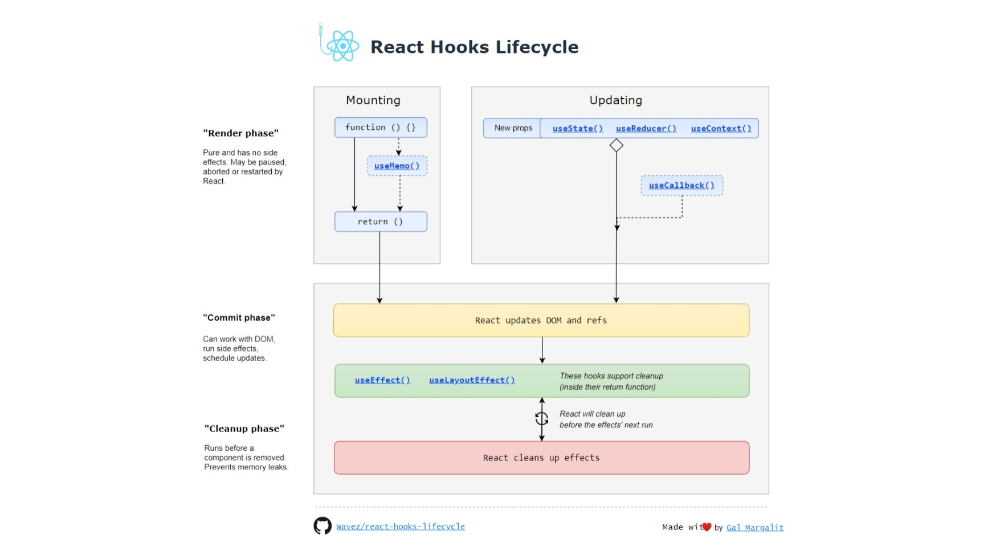

# Stateful dan Stateless Component

## Stateful Component

Ketika mendengar istilah "stateful", artinya sebuah komponen atau app akan menyimpan informasi terkait komponen tersebut. Dan komponen itu juga dapat mengubah informasi tersebut atau dengan kata lain, state

```JSX
import React, { Component } from 'react';

class App extends Component {
  constructor(props) {
    super(props);
    this.state = {
      userName: 'John Doe'
    }
  }

  render() {
    return (
      <div>
        <h1>Hello {this.state.userName}</h1>
      </div>
    );
  }
}

export default App;
```

## Stateless Component

Dan ketika mendengar istilah "stateless", artinya sebuah komponen tidak memiliki dan tidak bertanggungjawab terhadap state. Tugasnya hanya menampilkan data yang dikirim oleh parent component melalui props. Pada kasus tertentu, stateless component ini lebih dianjurkan daripada statefull component

```JSX
import React from 'react';

export default function App(props) {
  return (
    <div>
      <h1>Hello {props.userName}</h1>
    </div>
  );
}
```

## Class Component vs Functional Component

Pada awal kemunculannya, React memiliki Class component ( yang merupakan Statefull component ), dan functional component ( yang merupakan Stateless component ). Namun, sejak React versi 16.8, Hooks mulai diperkenalkan. Hooks ini membuat functional component dapat memiliki kemampuan yang sama dengan Class component, yaitu bisa memiliki state dan lifecycle. Hooks yang dimaksud di sini adalah useState dan useEffect Maintainer dan contributor dari React nampaknya lebih cenderung untuk merekomendasikan penggunaan Functional component, terutama untuk menjawab beberapa hal yang terkait dengan best practices,diantaranya untuk mempertahankan simplicity dan clean code

### Functional Component

Functional component adalah sebuah component yang dibuat menggunakan function. Pada awalnya functional component hanya bisa menerima props sebagai parameter, dan tidak bisa memiliki state. Namun, sejak React versi 16.8, Hooks mulai diperkenalkan. Hooks ini membuat functional component dapat memiliki kemampuan yang sama dengan Class component, yaitu bisa memiliki state dan lifecycle. Hooks yang dimaksud di sini adalah useState dan useEffect

```JSX
import React, { useState } from 'react';

function App() {
  const [count, setCount] = useState(0);

  return (
    <div>
      <p>You clicked {count} times</p>
      <button onClick={() => setCount(count + 1)}>
        Click me
      </button>
    </div>
  );
}

export default App;
```
<br/>

## Hooks

Hooks adalah fitur baru yang diperkenalkan pada React versi 16.8. Hooks memungkinkan kita untuk menggunakan state dan fitur-fitur React lainnya tanpa harus menulis sebuah class. Hooks juga memungkinkan kita untuk membagi komponen menjadi beberapa bagian yang lebih kecil.

### useState

Dalam versi React sebelumnya, komponen fungsional sering disebut juga stateless component karena gapunya state.Tapi istilah stateless sudah tidak lagi akurat karena ada useState.Jadi sekarang semua komponen baik yang class-based ataupun yang functional bisa punya state

```JSX
import React, { useState } from 'react';

function App() {
  const [count, setCount] = useState(0);

  return (
    <div>
      <p>You clicked {count} times</p>
      <button onClick={() => setCount(count + 1)}>
        Click me
      </button>
    </div>
  );
}

export default App;
```

### useEffect

useEffect adalah hook yang digunakan untuk menggantikan lifecycle method pada class-based component. useEffect akan dijalankan setelah setiap render. useEffect akan menerima sebuah callback function yang akan dijalankan setelah setiap render. useEffect juga akan menerima sebuah array sebagai parameter kedua. Array ini berisi variabel-variabel yang akan menjadi trigger untuk menjalankan useEffect. Jika array tersebut kosong, maka useEffect akan dijalankan setelah setiap render.

```JSX
import React, { useState, useEffect } from 'react';

function App() {
  const [count, setCount] = useState(0);

  useEffect(() => {
    document.title = `You clicked ${count} times`;
  });

  return (
    <div>
      <p>You clicked {count} times</p>
      <button onClick={() => setCount(count + 1)}>
        Click me
      </button>
    </div>
  );
}

export default App;
```

## React Hooks Lifecycle

Berikut diagram dari React Hooks Lifecycle

<div align="center">



</div>