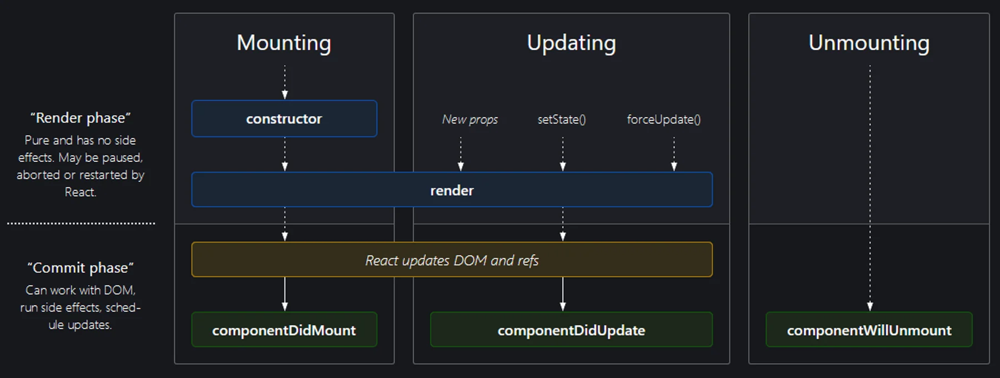

# React Component Lifecycle, Fetch Data, dan Study Case

<br/>

## Component Lifecycle

Komponen memiliki lifecycle yang berbeda-beda. Lifecycle ini adalah suatu proses yang berjalan secara berurutan. Lifecycle ini terdiri dari beberapa fase, yaitu:

  * Mounting
  * Updating
  * Unmounting

<div align="center">



</div>

### Mounting

Mounting adalah fase dimana komponen baru saja di pasang ke dalam DOM. Fase ini terdiri dari beberapa method, yaitu:

  * constructor()
  <!-- * getDerivedStateFromProps() -->
  * render()
  * componentDidMount()

#### - constructor()

Akan dipanggil saat sebuah komponen diinisialisasi. Seperti OOP dan class pada umumnya, constructor akan dipanggil pertama kali saat proses inisialisasi sebuah instance. Biasanya kita mendefinisikan state awal sebuah komponen dan melakukan deklarasi variable dan binding class method

<!-- #### - getDerivedStateFromProps()

Method ini akan dipanggil setelah constructor. Method ini digunakan untuk mengubah state berdasarkan props yang diterima. Method ini tidak perlu dipanggil secara manual. -->

#### - render()

Setiap komponen class harus memiliki method ini dan harus me-return sebuah komponen. Class method ini harus bersifat pure function dan jangan ada proses perubahan state disini

#### - componentDidMount()

Akan dipanggil ketika sebuah komponen selesai diletakkan di DOM sebuah browser. Method yang tepat untuk melakukan async request untuk mengambil data dari API. Hasil data yang didapat disimpan kedalam internal state dan akan men-trigger render() Component Lifecycle 


```javascript
class Clock extends React.Component {
    constructor(props) {
        super(props)
        this.state = {date: new Date()}
    }

    componentDidUpdate(){
        this.timerID = setInterval(
            () => this.tick(),
            1000
        )
    }

    tick() {
        this.setState({
            date: new Date()
        })
    }

    render() {
        return (
            <div>
                <h1>Hello, world!</h1>
                <h2>It is {this.state.date.toLocaleTimeString()}.</h2>
            </div>
        )
    }
}
```

<br/>

### Updating

Updating adalah fase dimana komponen baru saja di update. Fase ini terdiri dari beberapa method, yaitu:

  <!-- * getDerivedStateFromProps() -->
  * shouldComponentUpdate(nextProps, nextState)
  <!-- * render() -->
  <!-- * getSnapshotBeforeUpdate() -->
  * componentDidUpdate(prevProps, prevState)) 

#### - shouldComponentUpdate(nextProps, nextState)

Default behaviour dari React adalah selalu re-render setiap ada perubahan state atau props. Dengan function ini, kita bisa membatasi, keadaan / kejadian apa saja yang bisa men-trigger re-render. 

```javascript
class Halu extends React.Component() {
    constructor(props) {
        super(props);
        this.state = {
            count: 0,
            users: []
        }
    }

    shouldComponentUpdate(nextProps, nextState) {
        if(this.state.users.length !== nextState.users.length) {
            return true;
        }

        return false;
    }
}
```

Default return value dari function ini adalah true. Pada contoh di atas ini, kita mau bilang bahwa kita akan melakukan re-rendering hanya jika data users nya bertambah atau berkurang.

#### - componentDidUpdate(prevProps, prevState)

Method yang satu ini akan dipanggil tepat setelah render dipanggil. Kita bisa gunakan untuk operasi DOM atau request async untuk data berikutnya disini. Prefetch misalnya

```javascript
class Halu extends React.Component() {
    constructor(props) {
        super(props);
        this.state = {
            isLoading: true,
            data: []
        }
    }

    componentDidUpdate(prevProps, prevState) {
        if(prevProps.selectedState !== this.props.selectedState) {
            // fetch data
            fetch(`https://api.example.com/${this.props.selectedState}`)
                .then(res => res.json())
                .then(data => {
                    this.setState({
                        isLoading: false,
                        data: data
                    });
                })
                .catch(err => {
                    console.log(err);
                })
        }
    }
}
```

### Unmounting

Unmounting adalah fase dimana komponen baru saja di hapus dari DOM. Fase ini terdiri dari beberapa method, yaitu:

  * componentWillUnmount()

#### - componentWillUnmount()

Akan dipanggil sebelum kita menghapus komponen dari DOM. Kita bisa melakukan bersih-bersih di class method ini. Seperti menghapus timer, event listener, dan lain-lain

```javascript
class Halu extends React.Component() {
    componentDidMount() {
        eventData.addEventListener();
    }

    componentWillUnmount() {
        eventData.removeEventListener();
    }
}
```

### Error Handling

Error handling pada React bisa dilakukan dengan cara menambahkan method componentDidCatch(error, info) pada class component. Method ini akan dipanggil ketika terjadi error pada child component. 

```javascript
class ErrorBoundary extends React.Component {
    constructor(props) {
        super(props);
        this.state = { hasError: false };
    }

    static getDerivedStateFromError(error) {
        // Update state so the next render will show the fallback UI.
        return { hasError: true };
    }

    componentDidCatch(error, info) {
        // Example "componentStack":
        //   in ComponentThatThrows (created by App)
        //   in ErrorBoundary (created by App)
        //   in div (created by App)
        //   in App
        logComponentStackToMyService(info.componentStack);
    }

    render() {
        if (this.state.hasError) {
            // You can render any custom fallback UI
            return <h1>Something went wrong.</h1>;
        }

        return this.props.children; 
    }
}
```

## Functional Component

Functional component adalah cara yang lebih sederhana untuk membuat komponen. Kita bisa membuatnya dengan cara membuat function yang me-return sebuah komponen. 

```javascript

function Halu(props) {
    return (
        <div>
            <h1>Hello, {props.name}</h1>
        </div>
    )
}
```
Kita tentunya pernah melakukan pengambilan data, berlangganan data (subscription), atau secara manual mengubah DOM dari komponen React sebelumnya. Kami menyebut operasi-operasi seperti ini “efek samping (side effects)” (atau singkatnya “efek (effects)”) karena dapat mempengaruhi komponen lain dan tidak dapat dilakukan pada saat proses render.

Effect Hook, useEffect, menambahkan kemampuan untuk melakukan “efek samping” dari sebuah function component. Hook ini memiliki fungsi yang sama dengan componentDidMount, componentDidUpdate, dan componentWillUnmount pada kelas React, tetapi disatukan menjadi satu API Karena kita akan menggunakan Function Component untuk ke depannya, maka Hook ini lah yang akan banyak kita pakai.

```javascript
import React, { useState, useEffect } from 'react';

function Halu(props) {
    const [count, setCount] = useState(0);

    useEffect(() => {
        document.title = `You clicked ${count} times`;
    });

    return (
        <div>
            <h1>Hello, {props.name}</h1>
            <p>You clicked {count} times</p>
            <button onClick={() => setCount(count + 1)}>
                Click me
            </button>
        </div>
    )
}
```

## Fetching Data

dalam melakukan fetching data, dalam component react kita bisa menggunakan fungsi fetch untuk melakukan request data dari API. Untuk melakukan fetch API menggunakan dalam class component kita dapat menggunakan fungsi lifecycle componentDidMount().

```JSX
import React from 'react';

export default class Halu extends React.Component {
    constructor(props) {
        super(props);
        this.state = {
            isLoading: true,
            data: []
        }
    }

    componentDidMount() {
        fetch('https://api.example.com')
            .then(res => res.json())
            .then(data => {
                this.setState({
                    isLoading: false,
                    data: data
                });
            })
            .catch(err => {
                console.log(err);
            })
    }

    render() {
        return(
            <div>
                <h1>Hello, {this.props.name}</h1>
                {this.state.isLoading ? <p>Loading...</p> : <p>{this.state.data}</p>}
            </div>
        )
    }
}

```

sedangkan untuk melakukan fetch API menggunakan dalam functional component kita dapat menggunakan fungsi useEffect().

```JSX
import React, { useState, useEffect } from 'react';

export default function Halu(props) {
    const [isLoading, setIsLoading] = useState(true);
    const [data, setData] = useState([]);

    useEffect(() => {
        fetch('https://api.example.com')
            .then(res => res.json())
            .then(data => {
                setIsLoading(false);
                setData(data);
            })
            .catch(err => {
                console.log(err);
            })
    }, []);

    return(
        <div>
            <h1>Hello, {props.name}</h1>
            {isLoading ? <p>Loading...</p> : <p>{data}</p>}
        </div>
    )
}
```

## Study Case

#### 1. Membuat Realtime Clock

Clock.tsx

```TSX
import React, { useState, useEffect } from 'react';

export default function Clock() {
    const [time, setTime] = useState(new Date());

    useEffect(() => {
        const timer = setInterval(() => {
            setTime(new Date());
        }, 1000);

        return () => {
            clearInterval(timer);
        }
    }, []);

    return(
        <div>
            <h1>{time.toLocaleTimeString("en-US", {
                hour: "numeric",
                minute: "numeric",
                second: "numeric",
                hour12: true
            })}</h1>
        </div>
    )
}

```

App.tsx

```TSX
import React from 'react';
import Clock from './Clock';

export default function App() {
    return(
        <div>
            <Clock />
        </div>
    )
}
```

#### 2. Membuat Countdown Timer

Countdown.tsx

```TSX
import React from "react";

export default function Countdown() {
  const [countdown, setCountdown] = React.useState<number>(0);
  const [pause, setPause] = React.useState<boolean>(true);

  React.useEffect(() => {
    const interval = setInterval(() => {
      if (countdown > 0) {
        if (!pause) {
          setCountdown(countdown - 1);
        }
      }
    }, 1000);

    return () => clearInterval(interval);
  }, [countdown, pause]);

  return (
    <div style={{ width: "50%", margin: "100px auto", textAlign: "center" }}>
      <h1>{countdown}</h1>
      <input
        type="text"
        value={countdown}
        onChange={(e) => {
          setCountdown(Number(e.target.value));
          setPause(true);
        }}
      />
      <button onClick={() => setPause(false)}>Start</button>
      <button onClick={() => setPause(true)}>Stop</button>
    </div>
  );
}
```

App.tsx

```TSX
import React from 'react';
import Countdown from './Countdown';

export default function App() {
    return(
        <div>
            <Countdown />
        </div>
    )
}
```