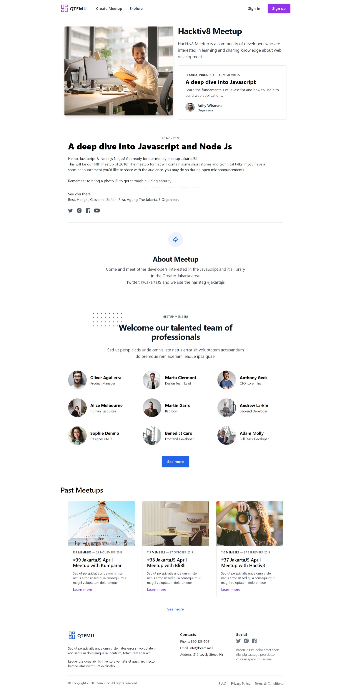
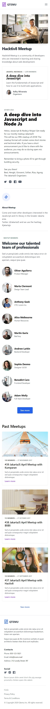

# Qtemu App

## Homework: Our First React App

Buatlah sebuah aplikasi meetup clone satu halaman dalam satu file js atau jsx saja seperti mockup dibawah ini.

Gunakan create-react-app.

## Atomize QTemu App

Lakukan refactor terhadap aplikasi QTemu yang dibuat sebelumnya sehingga memenuhi kaidah-kaidah atomic design yang sudah kamu pelajari. Jangan lupa gunakan juga state dan props.

#### Hasil Atomize dan Refactor QTemu App

 
 

