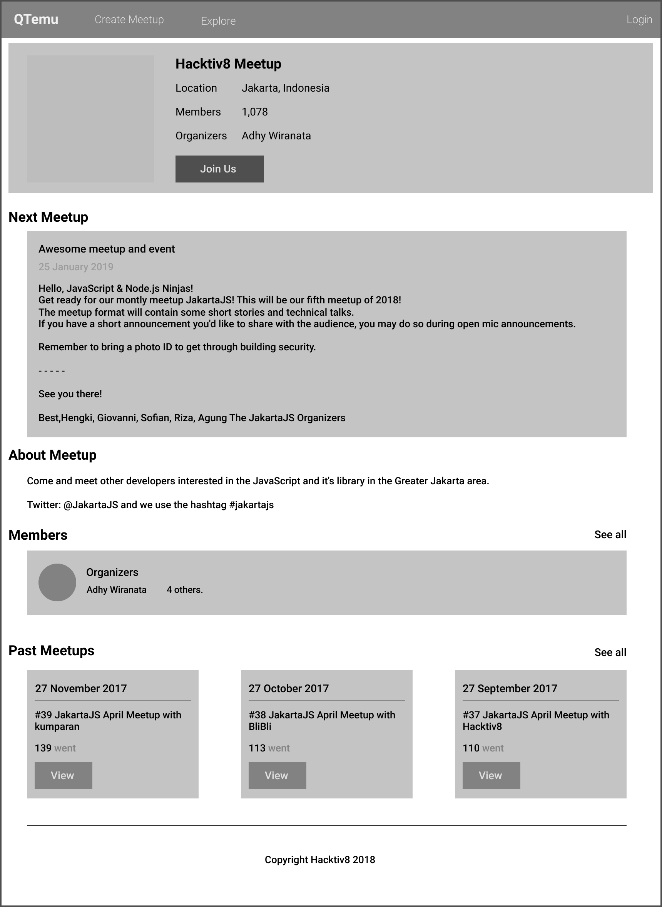

# Assignment 2: Qtemu App

 

## Homework: Our First React App

Buatlah sebuah aplikasi meetup clone satu halaman dalam satu file js atau jsx saja seperti mockup dibawah ini.

Gunakan create-react-app.

